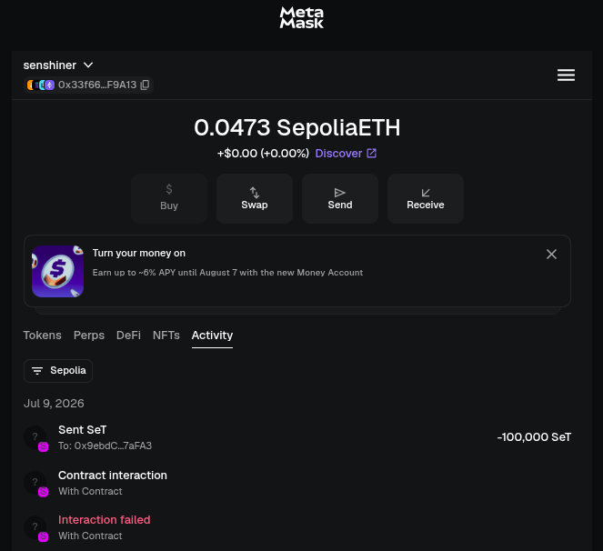
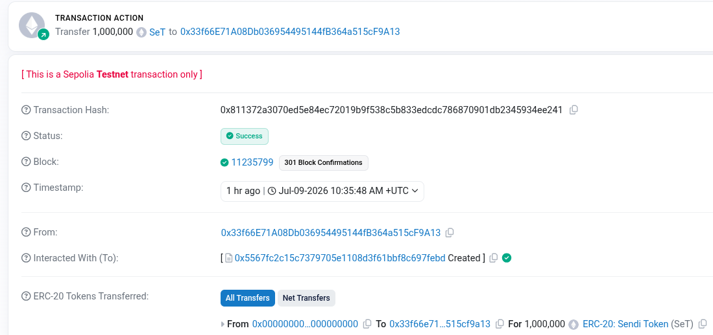
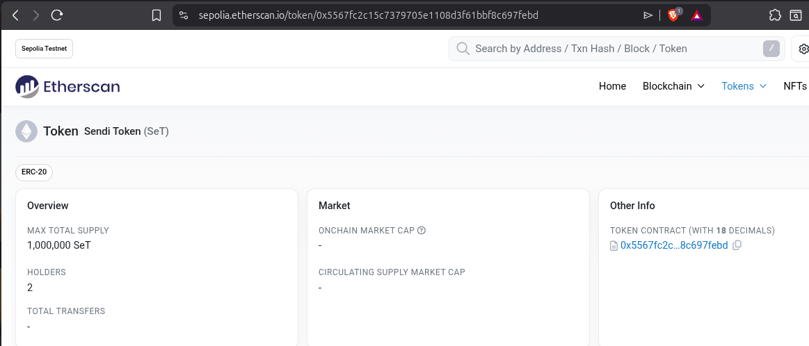

1. Token & ERC20 itu apa? Kenapa disebut "standar"?
 - Token adalah aset digital yang dibuat di atas jaringan blockchain.
 - ERC20 adalah aturan formal blueprint yang disepakati oleh komunitas Ethereum.
 - Kenapa disebut "standar"? Agar saat semua developer mengikuti aturan fungsi yang sama bisa langsung mengenali dan berinteraksi dengan token tersebut tanpa perlu menulis kode kustom dari nol untuk setiap token baru.

2. Bedanya "aksi baca" (mis. balanceOf) vs "aksi nulis" (mis. swap)?
   Yang mana yang bayar gas, kenapa?
 - Aksi Baca: Hanya mengambil data yg ada di dalam blockchain dari node lokal.
 - Aksi Nulis: Mengubah data tersimpan di dalam blockchain dan harus divalidasi semua jaringan validator.
 - Aksi nulis wajib bayar gas, karena membutuhkan daya komputasi dari jaringan validator untuk memproses dan mengamankan perubahan data tersebut secara permanen.

3. Dari 4 pertanyaan jebakan: mana yang AI-nya NGARANG? Gimana kamu tau?
 - Cara mengetahui AI ngarang: mencocokkan jawabannya langsung dengan kode yang ada di file kontrak dan dokumentasi resmi ERC20 OpenZeppelin. Jika kontrak hanya mewarisi ERC20 standar, maka fungsi seperti freezeAccount() itu gaib atau gak ada sama sekali.
   AI terbukti mengarang ketika dia mulai menulis kode fungsi yang tidak pernah dideklarasikan di dalam source code asli saya.

4. Kenapa transaksi on-chain harus dicek DULU sebelum tanda tangan?
 - Karena Transaksi di blockchain bersifat permanen sekali sudah masuk ke dalam blok. Maka dari itu mesti dicek dulu agar tidak ada hal yang tidak diinginkan atau human error.

---

BUKTI SCREENSHOT

- Screenshot Token di MetaMask

- Link Transaksi Swap di Etherscan

- Alamat Contract

