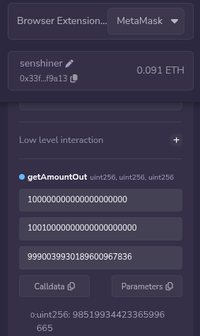
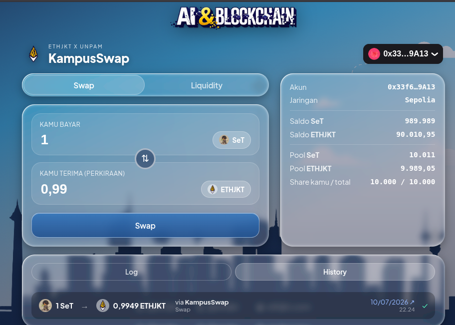

## Tokenku (Sendi Token(SeT))
- adalah token yang dibuat sendiri dan menyimpan jumlah pemilik token.
- transfer untuk mengirim token tersebut ke wallet lain.
- approve memberikan izin untuk menggunakan token milik saya sampai jumlah yang saya tentukan.

## SimpleAMM
- pool tempat simpan dua jenis token untuk saling ditukar.
- addLiquidity untuk memasukan dua jenis token ke pool.
- swap untuk saling menukar token yang tersedia di pool.

## Tunjuk 1 baris kode yang kemarin kamu NGGAK ngerti, sekarang paham.
- Baris yang awalnya belum saya pahami:
  tokenA.transferFrom(msg.sender, address(this), amountIn);
- Sekarang saya paham bahwa contract AMM menggunakan transferFrom() untuk mengambil token dari wallet pengguna, jadi perlu menggunakan approve terlebih dahulu untuk izinnya.

## DeFi itu apa, bedanya sama bank?

Menurut saya DeFi adalah layanan keuangan yang berjalan di blockchain menggunakan smart contract tanpa perlu pihak bank sebagai perantara.

Perbedaannya dengan bank adalah pada DeFi transaksi dilakukan langsung melalui contract dan wallet pribadi, sedangkan pada bank transaksi harus melalui lembaga yang mengatur dan menyimpan data serta uang nasabah. Di DeFi saya memegang sendiri aset dan akses wallet saya.

## ERC20 kasih kamu fungsi apa aja?

ERC20 memberikan standar fungsi dasar untuk membuat token di blockchain Ethereum.

Beberapa fungsi yang digunakan:

- transfer() untuk mengirim token ke wallet lain.
- balanceOf() untuk melihat jumlah token yang dimiliki suatu alamat.
- approve() untuk memberikan izin kepada contract menggunakan token saya.
- allowance() untuk melihat jumlah izin yang sudah diberikan.
- transferFrom() untuk memindahkan token berdasarkan izin approve sebelumnya.

## Bukti x*y=k

### Sebelum swap

reserveA = 10000 SeT

reserveB = 10000 ETHJKT

k sebelum
= 10000 × 10000
= 100.000.000

### Aksi

Saya melakukan swap 10 SeT menjadi ETHJKT.

### Sesudah swap

reserveA = 10010 SeT

reserveB = 9990.039930189600967836 ETHJKT

k sesudah
= 10010 × 9990.039930189600967836
≈ 100.000.299701197906686048

### Kesimpulan

Nilai k sesudah swap sedikit lebih besar dibandingkan sebelum swap.

k sebelum  = 100.000.000

k sesudah  ≈ 100.000.2997

Hal ini terjadi karena fee 0,3% dari transaksi tidak keluar dari pool, tetapi tetap berada di dalam pool sebagai keuntungan untuk penyedia likuiditas (Liquidity Provider). Karena ada fee yang tertinggal di pool, nilai k tidak benar-benar tetap, melainkan bertambah sedikit setelah swap.
### Bukti

- assets/reserveA.png
- assets/reserveB.png

## AI Swap Advisor vs Contract

Data pool:

reserveIn  = 10010000000000000000000

reserveOut = 9990039930189600967836

amountIn   = 100000000000000000000

Prediksi AI:

≈ 98.4 ETHJKT

Hasil contract (getAmountOut):

98.519934423365996665 ETHJKT

### Bukti

Hasil pemanggilan fungsi `getAmountOut()` di Remix:

### Analisis

Prediksi AI menghasilkan sekitar 98.4 ETHJKT, sedangkan contract menghitung
98.519934423365996665 ETHJKT.

Selisihnya sangat kecil sehingga prediksi AI cukup dekat dengan hasil contract.

### Kesimpulan

Contract tetap menjadi sumber kebenaran karena menghitung langsung menggunakan
rumus yang dipakai saat swap di blockchain. AI dapat membantu memperkirakan
hasil swap, tetapi keputusan akhir harus diverifikasi ke contract sebelum
melakukan transaksi.

## 5. Slippage itu apa?

Menurut saya slippage adalah selisih antara harga yang diharapkan dengan hasil yg benar-benar diterima saat swap.

Slippage terjadi karena jumlah token di dalam pool berubah sesuai rumus AMM. Semakin besar jumlah swap dibanding ukuran pool, biasanya slippage semakin besar dan token yang diterima menjadi lebih sedikit dari perkiraan awal.

## Frontend KampusSwap

Berhasil menghubungkan wallet MetaMask ke aplikasi KampusSwap.

Fitur yang berhasil diuji:
- Membaca saldo SeT
- Membaca saldo ETHJKT
- Membaca reserve pool
- Menampilkan estimasi swap
- Melakukan swap melalui web interface

