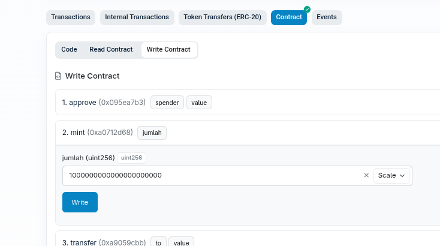
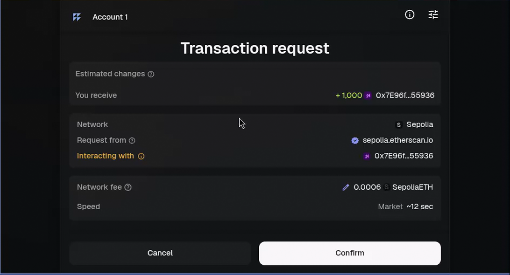
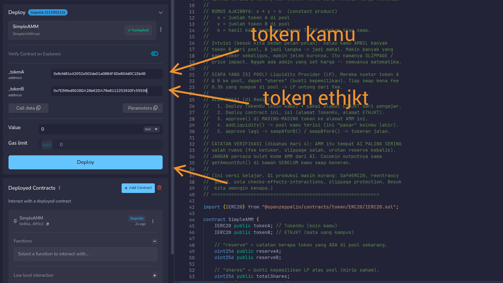
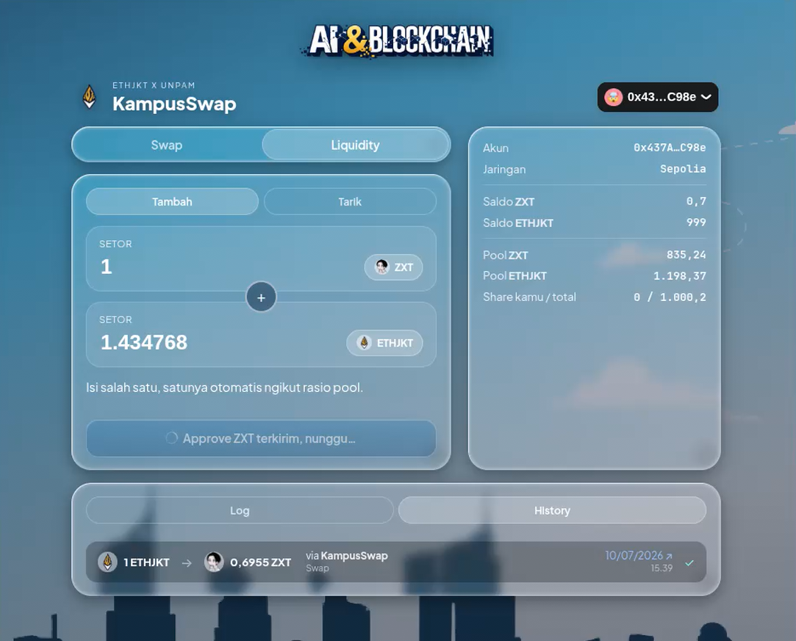
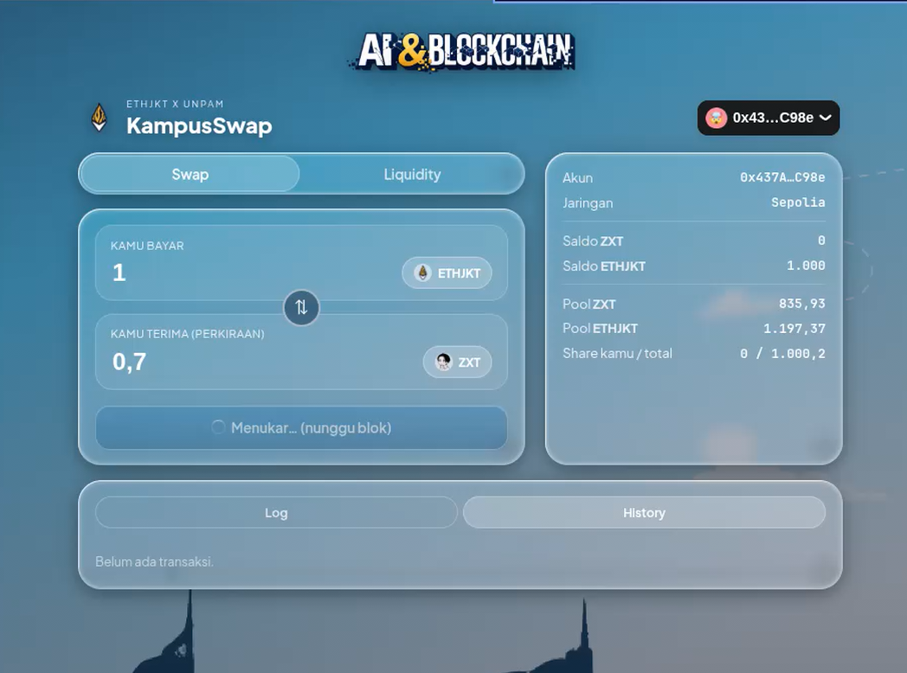

# TATA CARA INTERAKSI DAPP — KampusSwap (Sepolia)

Kumpulan tutorial langkah-demi-langkah buat berinteraksi dengan dApp KampusSwap
di jaringan **Sepolia** (testnet).

- **Tutorial 1 — Mint Token ETHJKT** (lewat Etherscan, tanpa Remix).
- **Tutorial 2 — Deploy Contract SimpleAMM** (lewat Remix).
- **Tutorial 3 — Konfigurasi & Jalankan App** (edit `config.ts`, `npm run dev`).
- **Tutorial 4 — Tambah Likuiditas (Add Liquidity) di App** (isi pool dulu, baru bisa swap).
- **Tutorial 5 — Swap Token di App** (tukeran beneran lewat interface).

> **INGAT:** kita cuma main di jaringan **Sepolia** (testnet). Jangan pernah
> pakai uang asli. Seed phrase / private key = RAHASIA MUTLAK, jangan kasih ke
> siapa pun termasuk AI.

===============================================================
# TUTORIAL 1 — Mint Token ETHJKT
===============================================================

Panduan ini ngajarin cara **mencetak (mint) 1000 token ETHJKT** langsung lewat
Etherscan, tanpa perlu Remix. Ini modal awal kamu buat isi likuiditas & swap
di KampusSwap.

---

## Alamat Contract ETHJKT

```
ETHJKT = 0x7E96fed902B0A26b62DA78e8112253920Fc55936
```

Contract ini sudah di-deploy pengajar dan **SUDAH VERIFIED** di Etherscan, jadi
kita bisa interaksi langsung lewat tab "Write Contract".

Buka halaman ini:
<https://sepolia.etherscan.io/address/0x7E96fed902B0A26b62DA78e8112253920Fc55936#writeContract>

---

## JEBAKAN ANGKA — 18 Desimal (baca dulu!)

Token ini pakai **18 angka di belakang koma** (decimals = 18). Artinya, fungsi
`mint()` minta jumlah dalam satuan terkecil (**wei**), BUKAN jumlah token biasa.

Jadi "1000 token" itu **bukan** `1000`, tapi 1000 + 18 nol:

```
      1 token      = 1000000000000000000          (1    + 18 nol)
      100 token    = 100000000000000000000        (100  + 18 nol)
      1000 token   = 1000000000000000000000       (1000 + 18 nol)   <-- INI yang kita pakai
```

> Salah jumlah nol = token yang kamu terima kekecilan/kegedean. Copy angka
> `1000000000000000000000` langsung dari sini biar aman.

---

## Langkah-Langkah Mint 1000 ETHJKT

```
[ ] 1. Buka link #writeContract di atas.
[ ] 2. Pastikan MetaMask kamu di jaringan SEPOLIA dan punya sedikit gas (ETH Sepolia).
[ ] 3. Klik tombol "Connect to Web3" -> pilih MetaMask -> Confirm koneksi.
       (kalau sukses, muncul bulatan hijau tanda wallet ke-connect.)
[ ] 4. Cari fungsi nomor 2: "mint (0xa0712d68)". Klik biar kebuka.
[ ] 5. Di kolom "jumlah (uint256)", tempel:
              1000000000000000000000
       (ini 1000 ETHJKT dalam wei — 1000 diikuti 18 nol.)
[ ] 6. Klik tombol "Write".
[ ] 7. MetaMask muncul -> CEK dulu di popup "Transaction request":
           - "You receive"  = + 1,000  (token ETHJKT masuk ke kamu)
           - "Network"       = Sepolia  (pastikan BUKAN mainnet!)
           - "Interacting with" = 0x7E96f...55936 (alamat ETHJKT bener)
       Kalau semua cocok -> klik tombol "Confirm" buat tanda tangan transaksi.
[ ] 8. Tunggu transaksi sukses (statusnya "Success" di Etherscan).
```

Setelah sukses, saldo ETHJKT kamu bertambah 1000 token. Cek di MetaMask (import
token pakai alamat `0x7E96...` kalau belum kelihatan).

---

## Bukti (Screenshot)

Beginilah tampilan tab **Write Contract** saat mengisi `mint()` dengan
`1000000000000000000000` (1000 ETHJKT):



Perhatikan:
- Fungsi **2. mint (0xa0712d68)** kebuka.
- Kolom **jumlah (uint256)** diisi `1000000000000000000000` (1000 + 18 nol).
- Tombol **Write** siap diklik → lanjut Confirm di MetaMask.

Setelah klik **Write**, MetaMask menampilkan popup **Transaction request**. Cek
dulu detailnya, baru klik **Confirm**:



Perhatikan:
- **You receive** = `+ 1,000` → benar, kamu bakal terima 1000 ETHJKT.
- **Network** = `Sepolia` → pastikan bukan mainnet (biar nggak kena biaya asli).
- **Interacting with** = `0x7E96f...55936` → alamat contract ETHJKT sudah cocok.
- **Network fee** = ~`0.0006 SepoliaETH` → cuma gas testnet (gratis dari faucet).
- Kalau semua cocok → klik **Confirm**.

---

## Kalau Gagal?

- **"Connect to Web3" nggak muncul / error** → refresh halaman, pastikan
  MetaMask ke-unlock dan di jaringan Sepolia.
- **Transaksi gagal / pending lama** → gas Sepolia kamu habis. Ambil ETH
  Sepolia gratis dari faucet dulu.
- **Saldo nggak muncul di MetaMask** → "Import tokens" secara manual pakai
  alamat contract `0x7E96fed902B0A26b62DA78e8112253920Fc55936`.

---

Pelajaran bintang: **transaksi on-chain itu FINAL.** Cek angka & jaringan dulu,
baru tanda tangan. Selamat, kamu udah punya modal ETHJKT!

===============================================================
# TUTORIAL 2 — Deploy Contract SimpleAMM
===============================================================

Di tutorial ini kamu bakal **deploy `SimpleAMM.sol`** ke Sepolia lewat Remix.
SimpleAMM ini "pasar"-nya: kolam (pool) berisi 2 token yang bikin swap otomatis
pakai rumus `x * y = k`.

### Syarat sebelum mulai

```
[ ] Punya alamat KOINMU (TokenKu) dari Hari 3.                <- token A
[ ] Punya alamat ETHJKT: 0x7E96fed902B0A26b62DA78e8112253920Fc55936  <- token B
[ ] MetaMask di jaringan SEPOLIA + ada gas (ETH Sepolia).
[ ] File SimpleAMM.sol (ada di folder hari-4 ini).
```

---

## Langkah 1 — Buka Remix & Muat Contract

```
[ ] 1. Buka https://remix.ethereum.org
[ ] 2. Di panel "File Explorer" (kiri), bikin file baru: SimpleAMM.sol
[ ] 3. Copy-paste seluruh isi hari-4/SimpleAMM.sol ke situ.
```

---

## Langkah 2 — Compile

```
[ ] 1. Klik tab "Solidity Compiler" (ikon Solidity di kiri).
[ ] 2. Pilih compiler versi 0.8.20 ke atas (harus cocok sama `pragma ^0.8.20`).
[ ] 3. Klik "Compile SimpleAMM.sol".
       Remix otomatis ngambil library OpenZeppelin (IERC20) dari import.
[ ] 4. Pastikan muncul centang HIJAU (tanda compile sukses, tanpa error).
```

---

## Langkah 3 — Sambungin MetaMask ke Remix

```
[ ] 1. Klik tab "Deploy & Run Transactions" (ikon Ethereum).
[ ] 2. Di dropdown "ENVIRONMENT", pilih "Injected Provider - MetaMask".
[ ] 3. MetaMask muncul -> Connect. Pastikan jaringannya SEPOLIA.
       Cek: di bawah ENVIRONMENT harus tertulis "Custom (11155111) network"
       (11155111 = chain id Sepolia).
```

---

## Langkah 4 — Isi Constructor & Deploy (URUTAN PENTING!)

Constructor SimpleAMM minta **2 alamat**, dan **urutannya nggak boleh kebalik**:

```
constructor(address _tokenA, address _tokenB)
        _tokenA = alamat KOINMU (TokenKu, dari Hari 3)
        _tokenB = alamat ETHJKT (0x7E96fed902B0A26b62DA78e8112253920Fc55936)
```

```
[ ] 1. Pastikan dropdown "CONTRACT" nunjuk ke "SimpleAMM".
[ ] 2. Di sebelah tombol "Deploy", ada kolom input. Klik panah kecil biar
       kebuka jadi 2 isian: _TOKENA dan _TOKENB.
[ ] 3. Isi:
             _TOKENA  = <alamat KOINMU>
             _TOKENB  = 0x7E96fed902B0A26b62DA78e8112253920Fc55936
[ ] 4. Klik tombol "Deploy" (oranye).
[ ] 5. MetaMask muncul -> cek jaringan SEPOLIA -> klik "Confirm".
[ ] 6. Tunggu sampai transaksi sukses (cek di kolom log Remix bawah).
```

> **AWAS — INI PERMANEN.** Kalau `_TOKENA` & `_TOKENB` kebalik atau salah
> alamat, pool bakal nunjuk token yang salah SELAMANYA. Nggak bisa diedit —
> harus deploy ulang dari awal. Cek dua kali sebelum Confirm.

### Bukti (Screenshot)

Beginilah tampilan panel **Deploy** di Remix saat mengisi constructor SimpleAMM,
lengkap dengan urutan token yang benar:



Perhatikan (sesuai panah di gambar):
- **`_tokenA`** = `0x8cfd81e42052a502da01a0884F4De804d0C1Eb4B`
  → ini **TOKEN KAMU** yang kamu deploy di Hari 3.
- **`_tokenB`** = `0x7E96fed902B0A26b62DA78e8112253920Fc55936`
  → ini **TOKEN ETHJKT** (mata uang kampus).
- Jaringan pojok atas = **Sepolia (11155111)**, status contract = **Compiled**.
- Setelah kedua alamat terisi benar → klik **Deploy** (tombol biru) → Confirm
  di MetaMask. Contract muncul di **Deployed Contracts** (lihat `0x60a...695c3`).

---

## Langkah 5 — Simpan Alamat SimpleAMM

```
[ ] 1. Setelah sukses, contract muncul di bagian bawah "Deployed Contracts".
[ ] 2. Klik ikon "copy" di sebelah nama contract buat nyalin ALAMAT SimpleAMM.
[ ] 3. SIMPAN alamat ini baik-baik — ini "alamat pasar" kamu. Dipakai buat:
             - approve() di kedua token (izinin pasar narik token)
             - addLiquidity() (isi pool)
             - swapAforB() / swapBforA() (tukeran)
```

Verifikasi cepat (opsional tapi bagus): panggil fungsi `tokenA()` dan `tokenB()`
di Deployed Contracts. Hasilnya harus persis alamat KOINMU dan ETHJKT. Kalau
cocok → deploy kamu benar.

---

## Setelah Deploy — Lanjut ke Mana?

Pool kamu sudah lahir, tapi masih KOSONG. Langkah berikutnya (lihat README
hari-4, Checkpoint 3–5):

```
[ ] approve()      -> izinin SimpleAMM narik KOINMU & ETHJKT dari dompet.
[ ] addLiquidity() -> setor 1000 KOINMU + 1000 ETHJKT, pool terisi 1:1.
[ ] swapAforB()    -> tukeran beneran, harga gerak otomatis.
```

---

## Kalau Gagal?

- **Compile error "file not found" (OpenZeppelin)** → cek koneksi internet;
  Remix narik `@openzeppelin/contracts` dari npm otomatis. Compile ulang.
- **"Injected Provider" nggak nongol** → pastikan MetaMask ke-install &
  ke-unlock, lalu refresh Remix.
- **Deploy gagal / "insufficient funds"** → gas Sepolia habis, ambil dari
  faucet dulu.
- **`tokenA()`/`tokenB()` hasilnya kebalik** → kamu masukin `_TOKENA`/`_TOKENB`
  ketuker. Deploy ulang dengan urutan benar.

---

Pelajaran bintang (lagi): **contract yang sudah ke-deploy itu IMMUTABLE.**
Alamat token di constructor nggak bisa diubah. Cek urutan `_TOKENA`/`_TOKENB`
DULU, baru Deploy. Selamat — pasar koinmu resmi berdiri di blockchain!

===============================================================
# TUTORIAL 3 — Konfigurasi & Jalankan App
===============================================================

Sekarang contract-mu (KOINMU, ETHJKT, SimpleAMM) sudah on-chain. Tutorial ini
nyambungin semuanya ke **interface web KampusSwap** (`app/`). Kabar baiknya:
kamu **cukup edit SATU file** → `app/config.ts`.

### Syarat sebelum mulai

```
[ ] Node.js + npm ke-install (cek: `node -v` dan `npm -v` di terminal).
[ ] 3 alamat sudah di tangan:
        - AMM_ADDRESS      = alamat SimpleAMM (dari Tutorial 2)
        - TOKEN_A.address  = alamat KOINMU (day-3)
        - TOKEN_B.address  = alamat ETHJKT (0x7E96...55936)
```

---

## Langkah 1 — Buka & Edit `app/config.ts`

File ada di `hari-4/app/config.ts`. Ganti 3 baris alamat jadi punyamu:

```ts
export const CONFIG = {
  // ...

  // Alamat pool AMM kamu (hasil deploy SimpleAMM di Tutorial 2).
  AMM_ADDRESS: "0x60a19Da3F8CFA6F64a35a374CE0e5a7bC2d695c3",   // <- GANTI

  // TOKEN A = KOIN KAMU (harus SAMA dengan tokenA di SimpleAMM).
  TOKEN_A: {
    address: "0x8cfd81e42052a502da01a0884F4De804d0C1Eb4B",     // <- GANTI
    logo: "/zexoverz.webp",
  },

  // TOKEN B = ETHJKT (token bersama dari pengajar).
  TOKEN_B: {
    address: "0x7E96fed902B0A26b62DA78e8112253920Fc55936",     // biarin (ETHJKT resmi)
    logo: "/ethjkt-logo.png",
  },
};
```

> **PENTING — harus KONSISTEN sama contract.** `TOKEN_A.address` di config
> WAJIB sama persis dengan `tokenA()` di SimpleAMM, dan `TOKEN_B.address` sama
> dengan `tokenB()`. Kalau ketuker, app baca pool kebalik → angka swap ngaco.

Yang lain (opsional):

```
[ ] Logo token: taruh gambar di app/public/, lalu tulis path "/namafile.png"
    di field "logo". (contoh: /koinku.png)
[ ] WALLETCONNECT_PROJECT_ID: bikin gratis di https://cloud.reown.com ->
    New Project -> copy Project ID. Kalau kosong, connect MetaMask tetap jalan,
    cuma QR WalletConnect yang nggak aktif.
```

---

## Langkah 2 — Install Dependency & Jalankan

Buka terminal, masuk ke folder `app/`, lalu:

```bash
cd hari-4/app
npm install       # sekali aja, download dependency (React, wagmi, viem, dll)
npm run dev       # nyalain server dev Vite
```

```
[ ] Muncul URL lokal, biasanya http://localhost:5173
[ ] Buka URL itu di browser. Interface KampusSwap tampil.
[ ] Isi pool (reserve A & B) langsung kebaca TANPA connect wallet
    (app baca lewat RPC publik Sepolia dari config).
```

---

## Langkah 3 — Connect Wallet & Swap

```
[ ] 1. Klik "Connect Wallet" -> pilih MetaMask -> pastikan jaringan SEPOLIA.
[ ] 2. Masukin jumlah token yang mau dituker.
[ ] 3. Kalau pertama kali, app minta approve() dulu -> Confirm di MetaMask.
[ ] 4. Klik Swap -> cek angka perkiraan -> Confirm.
[ ] 5. Saldo di MetaMask berubah, reserve pool di app ikut update.
```

Selamat — dApp koinmu sekarang jalan lengkap: dari contract on-chain sampai
interface web yang bisa dipakai orang lain buat swap!

---

## Kalau Gagal?

- **`npm run dev` error / port kepakai** → tutup proses lain, atau jalanin
  `npm run dev -- --port 3000`.
- **Pool reserve tampil 0 / kosong** → cek `AMM_ADDRESS` di config bener, dan
  pool-nya memang sudah diisi `addLiquidity()` (lihat README Checkpoint 4).
- **Angka swap aneh / kebalik** → `TOKEN_A`/`TOKEN_B` di config ketuker dari
  yang di contract. Samain sama `tokenA()`/`tokenB()` di SimpleAMM.
- **Wallet nggak mau connect** → pastikan MetaMask di jaringan Sepolia; isi
  `WALLETCONNECT_PROJECT_ID` kalau mau pakai WalletConnect/QR.

> **Catatan:** swap cuma jalan kalau pool SUDAH ada isinya. Kalau pool masih
> kosong (reserve 0), tambahin likuiditas dulu → lanjut **Tutorial 4**.

===============================================================
# TUTORIAL 4 — Tambah Likuiditas (Add Liquidity) di App
===============================================================

Sebelum bisa swap, pool HARUS ada isinya. Di tutorial ini kamu nyetor 2 token
(KOINMU + ETHJKT) ke pool lewat interface app — bukan lagi lewat Remix.

> Kamu jadi **Liquidity Provider (LP)**: nyetor token, dapet "shares" (bukti
> kepemilikan pool). Tiap swap orang lain kena fee 0.3% yang numpuk buat LP.

### Syarat

```
[ ] App KampusSwap sudah jalan (Tutorial 3) & wallet ke-connect di Sepolia.
[ ] Punya saldo KOINMU + ETHJKT di dompet (kalau kurang: mint lagi — Tutorial 1).
```

---

## Langkah-Langkah

```
[ ] 1. Di app, klik tab "Liquidity" (sebelah tab "Swap").
[ ] 2. Pastikan mode "Tambah" yang aktif (bukan "Tarik").
[ ] 3. Isi jumlah di kolom SETOR. Idealnya 1000 dan 1000 buat kedua token
       (rasio 1:1) KALAU pool masih baru/kosong.
[ ] 4. Approve token dulu kalau diminta -> Confirm di MetaMask
       (muncul tulisan "Approve ... terkirim, nunggu...").
[ ] 5. Setelah approve sukses, klik tombol tambah likuiditas -> Confirm.
[ ] 6. Cek panel kanan: "Pool" & "Share kamu / total" naik. Pool terisi!
```

### Kalau Pool SUDAH Ada Isinya (rasio ngikut)

Kalau pool udah pernah diisi/dipakai (kayak di screenshot bawah), harganya
UDAH nggak 1:1 lagi. Kamu **cukup isi SALAH SATU kolom**, kolom satunya
**otomatis ngisi ngikut rasio pool sekarang** — biar setoranmu nggak ngerusak
harga. Jadi wajar kalau kamu ketik `1` ZXT, ETHJKT-nya jadi angka ganjil
(misal `1.434768`), bukan `1`.

---

## Bukti (Screenshot)

Tab **Liquidity → Tambah** di app. Di sini pool sudah punya likuiditas awal &
sudah dipakai swap, jadi rasionya nggak 1:1 lagi:



Perhatikan:
- Tab **Liquidity** aktif, mode **Tambah**.
- **SETOR** = `1` ZXT (token kamu) → kolom bawah **otomatis** `1.434768` ETHJKT.
  Ini bukti "isi salah satu, satunya ngikut rasio pool".
- Panel kanan: **Pool ZXT** `835,24`, **Pool ETHJKT** `1.198,37` → pool memang
  udah keisi (makanya rasio bukan 1:1).
- **Share kamu / total** `0 / 1.000,2` → total shares pool, punyamu belum masuk
  sampai transaksi selesai.
- Tombol lagi proses **"Approve ZXT terkirim, nunggu..."** → tinggal Confirm &
  tunggu, lalu lanjut tambah likuiditas.

---

## Setelah Pool Terisi

Balik ke tab **Swap** → sekarang swap bisa jalan (lihat Tutorial 3, Langkah 3).
Coba swap kecil, lalu cek reserve pool di panel kanan ikut gerak.

---

## Kalau Gagal?

- **`insufficient allowance`** → approve belum sukses/kurang. Ulang approve dulu.
- **`jumlah nol` / gagal** → saldo KOINMU atau ETHJKT kurang. Mint lagi
  (Tutorial 1) atau kecilin jumlah setor.
- **Angka pasangan nggak ke-auto-isi** → pool masih kosong; kamu LP pertama,
  jadi kamu yang nentuin rasio awal (isi kedua kolom manual, misal 1000 & 1000).

===============================================================
# TUTORIAL 5 — Swap Token di App
===============================================================

Pool udah keisi (Tutorial 4), sekarang saatnya **tukeran beneran**: kasih 1
token, dapet token satunya. Harga ditentuin otomatis sama rumus `x * y = k`.

### Syarat

```
[ ] Pool sudah ada isinya (reserve ZXT & ETHJKT > 0).
[ ] Wallet ke-connect di Sepolia + punya saldo token yang mau dikasih.
```

---

## Langkah-Langkah

```
[ ] 1. Klik tab "Swap".
[ ] 2. Pilih token yang mau kamu BAYAR (kolom "KAMU BAYAR"). Pakai ikon panah
       naik-turun (⇅) di tengah buat balik arah swap.
[ ] 3. Ketik jumlah yang mau dituker (misal 1 ETHJKT).
[ ] 4. Lihat "KAMU TERIMA (PERKIRAAN)" -> app ngitung otomatis pakai
       getAmountOut() (udah termasuk fee 0.3% + slippage).
[ ] 5. Approve dulu kalau diminta -> Confirm di MetaMask.
[ ] 6. Klik Swap -> Confirm. Muncul "Menukar... (nunggu blok)".
[ ] 7. Setelah masuk blok: saldo berubah, reserve pool di panel kanan gerak,
       transaksi nongol di "History".
```

> **KENAPA 1 ETHJKT cuma dapet ~0,7 ZXT, bukan 1:1?** Karena (a) fee 0.3%
> ketinggal di pool, dan (b) **slippage** — pool ZXT lebih sedikit (`835,93`)
> dibanding ETHJKT (`1.197,37`), jadi ZXT lebih "mahal". Makin gede swap-mu,
> makin jelek kursnya. Ini murni matematika `x*y=k`, bukan admin yang set harga.

---

## Bukti (Screenshot)

Tab **Swap** di app, nuker 1 ETHJKT jadi ZXT:



Perhatikan:
- **KAMU BAYAR** = `1` ETHJKT → **KAMU TERIMA (PERKIRAAN)** = `0,7` ZXT.
- Panel kanan: **Pool ZXT** `835,93`, **Pool ETHJKT** `1.197,37` → ETHJKT lebih
  banyak, jadi 1 ETHJKT wajar dapet ZXT lebih dikit.
- Status tombol **"Menukar... (nunggu blok)"** → transaksi udah dikirim, tinggal
  nunggu masuk blok Sepolia.
- Setelah beres, reserve pool bakal berubah (ETHJKT naik, ZXT turun) & swap
  masuk ke tab **History**.

---

## Verifikasi (inti pelajaran Hari 4)

Jadilah HAKIM, jangan asal percaya angka:

```
[ ] Catat reserve SEBELUM swap: k_sebelum = PoolZXT * PoolETHJKT.
[ ] Lakuin swap kecil.
[ ] Catat reserve SESUDAH: k_sesudah = PoolZXT * PoolETHJKT.
[ ] Bandingin: k_sesudah harus >= k_sebelum (naik dikit gara-gara fee 0.3%).
```

Cocokin juga angka "KAMU TERIMA" di app sama hasil `getAmountOut()` di Remix —
harus sama. Kalau AI (Swap Advisor) ngasih angka beda, **contract yang bener**.

---

## Kalau Gagal?

- **`insufficient allowance`** → approve token yang kamu bayar belum sukses.
- **`insufficient balance`** → saldo token kamu kurang; mint/tambah dulu.
- **Angka terima 0** → jumlah kekecilan atau pool hampir kosong; cek reserve.
- **Transaksi pending lama** → gas Sepolia kurang, atau jaringan lagi sibuk;
  tunggu atau naikin gas di MetaMask.

---

Selamat! Kamu udah jalanin siklus penuh dApp: **mint → deploy AMM → config app →
add liquidity → swap.** Dari nol sampai pasar koinmu hidup & bisa dipakai orang.
Sekarang lanjut ke BABAK 2 di README: buktiin kamu PAHAM. 🚀
